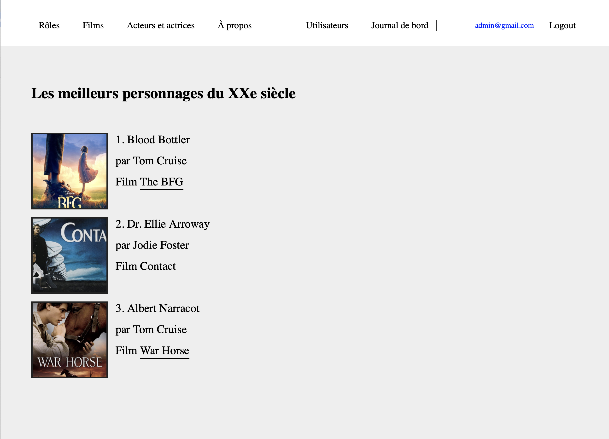

# Projet Stampee

## This is a film archive website, where:

1. Logged-in users can access information about films, actors/actresses, view and vote for their favorite characters/roles.
2. Non-logged-in visitors can only access information about films, actors/actresses, and the latest voting status of characters.
3. The administrator can access information about films, actors/actresses, and the latest voting status. They can also add films (with an image), edit and delete them, view the logbook, and add users. However, they cannot vote.

## Connection 

### Database: 
Go to /sql/connectDB.sql

### Path configuration
1. Go to /index.php
2. Change "define('PATH_DIR', 'http://localhost:8888/filmclub/');"

### Database configuration
1. Go to /model/CRUD.php
2. Change "parent::__construct('mysql:host=localhost; dbname=film; port=8889; charset=utf8', 'root', 'root');"

## Test data
1. Admin 
- User id: admin@gmail.com
- Password: 12345

2. User 2
- User id: user2@gmail.com
- Password: abcde

3. User 3
- User id: user3@gmail.com
- Password: abcde

4. User 4
- User id: user4@gmail.com
- Password: abcde

5. User 5
- User id: user5@gmail.com
- Password: abcde

6. Log in as Admin and create your own user